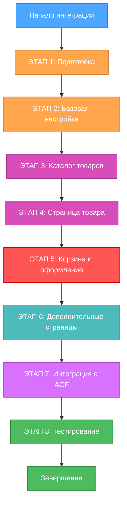

---

# 🛒 ПЛАН ИНТЕГРАЦИИ WOOCOMMERCE

**Дата создания:** 2025-10-28  
**Статус:** Планирование (0% выполнено)  
**Сложность:** Level 4 (Enterprise)

## 📋 EXECUTIVE SUMMARY

Интеграция WooCommerce для создания полноценного интернет-магазина электрогенераторов с каталогом товаров, корзиной, оформлением заказа и управлением через админ-панель WordPress.

**Ключевые цифры:**
- Этапов интеграции: 8
- Режимов работы: 6 (VAN → PLAN → CREATIVE → IMPLEMENT → REFLECT → ARCHIVE)
- Файлов для создания: ~15-20
- Ожидаемое время: 2-3 недели

---

## 🎯 ЦЕЛИ ИНТЕГРАЦИИ

### Основные цели:
1. ✅ Полноценный интернет-магазин с корзиной и оформлением заказа
2. ✅ Каталог товаров с фильтрацией и сортировкой
3. ✅ Страница товара с характеристиками и галереей
4. ✅ Управление заказами через админ-панель
5. ✅ Интеграция с существующим дизайном
6. ✅ Адаптивность для всех устройств

### Дополнительные цели:
- 📧 Email-уведомления о заказах
- 💳 Интеграция способов оплаты
- 🚚 Настройка доставки
- 📊 Отслеживание заказов
- 🎁 Система скидок и купонов

---

## 📊 СТРУКТУРА ИНТЕГРАЦИИ



---

## 🔄 РЕЖИМЫ РАБОТЫ И ЭТАПЫ

### Workflow по уровню сложности Level 4:
```
VAN → PLAN → CREATIVE → IMPLEMENT → REFLECT → ARCHIVE
```

### Применение режимов к этапам:

| Этап | Режимы | Описание |
|------|--------|----------|
| **ЭТАП 1: Подготовка** | VAN → PLAN | Анализ требований, планирование |
| **ЭТАП 2: Базовая настройка** | IMPLEMENT → REFLECT | Установка, базовая конфигурация |
| **ЭТАП 3: Каталог товаров** | CREATIVE → IMPLEMENT → REFLECT | Дизайн каталога, интеграция с версткой |
| **ЭТАП 4: Страница товара** | CREATIVE → IMPLEMENT → REFLECT | Дизайн карточки товара |
| **ЭТАП 5: Корзина и оформление** | CREATIVE → IMPLEMENT → REFLECT | Переработка корзины и чекаута |
| **ЭТАП 6: Дополнительные страницы** | IMPLEMENT → REFLECT | Личный кабинет, заказы |
| **ЭТАП 7: Интеграция с ACF** | CREATIVE → IMPLEMENT | Дополнительные поля товаров |
| **ЭТАП 8: Тестирование** | REFLECT → ARCHIVE | Финальная проверка, документация |

---

## 📝 ДЕТАЛЬНЫЕ ЭТАПЫ С ПРОМПТАМИ

### **ЭТАП 1: ПОДГОТОВКА И АНАЛИЗ**

#### Режим: VAN (Инициализация)

**Промпт для VAN режима:**
```
Мне нужно интегрировать WooCommerce в существующую тему WordPress для сайта электрогенераторов. 

КОНТЕКСТ:
- Тема уже имеет готовую верстку для каталога (catalog-generators.html) и страницы товара (product.html)
- Используется БЭМ методология
- Есть Custom Post Types для проектов и тендеров
- ACF Pro установлен и используется

ЗАДАЧА:
Необходимо интегрировать WooCommerce так, чтобы:
1. Каталог товаров использовал существующую верстку
2. Карточка товара соответствовала дизайну
3. Корзина и оформление заказа были адаптивными
4. Все работало с существующими стилями

Запусти VAN режим для анализа и инициализации задачи.
```

**Ожидаемый результат VAN:**
- ✅ Определение сложности: Level 4 (Enterprise)
- ✅ Создание задачи в tasks.md
- ✅ Анализ существующей структуры
- ✅ Определение зависимостей

---

#### Режим: PLAN (Планирование)

**Промпт для PLAN режима:**
```
Продолжаем интеграцию WooCommerce. Перешли в режим PLAN.

ЦЕЛЬ:
Создать детальный план интеграции WooCommerce с учетом:
1. Существующей верстки каталога и товара
2. Необходимости кастомизации стандартных шаблонов WooCommerce
3. Интеграции с ACF для дополнительных полей
4. Адаптивности и соответствия дизайну

ТРЕБОВАНИЯ:
- Определить список всех файлов для создания/модификации
- Составить последовательность действий
- Выявить потенциальные проблемы
- Определить, нужен ли CREATIVE режим для каких-то компонентов

Запусти PLAN режим.
```

**Ожидаемый результат PLAN:**
- ✅ Детальный план интеграции
- ✅ Список файлов для создания
- ✅ Выявленные риски и их решения
- ✅ Определение компонентов для CREATIVE режима
- ✅ Обновленный tasks.md с планом

---

### **ЭТАП 2: БАЗОВАЯ НАСТРОЙКА WOOCOMMERCE**

#### Режим: IMPLEMENT (Реализация)

**Промпт для IMPLEMENT режима:**
```
Начинаем базовую настройку WooCommerce. Режим IMPLEMENT.

ЗАДАЧИ:
1. Добавить поддержку WooCommerce в functions.php
2. Настроить базовые хуки и фильтры
3. Отключить стандартные стили WooCommerce
4. Настроить базовые параметры магазина
5. Создать структуру директорий для кастомных шаблонов

КОД ДЛЯ ДОБАВЛЕНИЯ В functions.php:
// Поддержка WooCommerce
function dsa_add_woocommerce_support() {
    add_theme_support('woocommerce');
    add_theme_support('wc-product-gallery-zoom');
    add_theme_support('wc-product-gallery-lightbox');
    add_theme_support('wc-product-gallery-slider');
}
add_action('after_setup_theme', 'dsa_add_woocommerce_support');

// Отключение стандартных стилей WooCommerce
add_filter('woocommerce_enqueue_styles', '__return_empty_array');

Выполни эти действия в IMPLEMENT режиме.
```

**Ожидаемый результат IMPLEMENT:**
- ✅ Обновленный functions.php
- ✅ Создана директория woocommerce/ в теме
- ✅ Базовая конфигурация выполнена
- ✅ WooCommerce активирован и работает

---

#### Режим: REFLECT (Проверка)

**Промпт для REFLECT режима:**
```
Проверка базовой настройки WooCommerce. Режим REFLECT.

ПРОВЕРИТЬ:
1. WooCommerce корректно подключен к теме
2. Стандартные стили отключены
3. Базовые страницы созданы
4. Нет конфликтов со существующей версткой
5. Админ-панель WooCommerce работает

Запусти REFLECT режим для анализа выполненной работы.
```

**Ожидаемый результат REFLECT:**
- ✅ Отчет о проверке
- ✅ Выявленные проблемы (если есть)
- ✅ Рекомендации для следующего этапа
- ✅ Обновленный progress.md

---

### **ЭТАП 3: КАТАЛОГ ТОВАРОВ**

#### Режим: CREATIVE (Проектирование)

**Промпт для CREATIVE режима:**
```
Проектирование интеграции каталога товаров. Режим CREATIVE.

ПРОБЛЕМА:
Нужно интегрировать существующую верстку каталога (catalog-generators.html) 
с стандартным шаблоном WooCommerce (archive-product.php).

ТРЕБОВАНИЯ:
1. Сохранить существующий дизайн
2. Использовать стандартные хуки WooCommerce
3. Интегрировать фильтры по мощности, производителю и т.д.
4. Поддержать пагинацию
5. Адаптивность для всех устройств

ОПЦИИ ДЛЯ РАССМОТРЕНИЯ:
A. Полная замена archive-product.php кастомным шаблоном
B. Использование хуков WooCommerce для модификации стандартного шаблона
C. Гибридный подход: кастомный шаблон + хуки

Запусти CREATIVE режим для выбора оптимального решения.
```

**Ожидаемый результат CREATIVE:**
- ✅ Анализ опций
- ✅ Выбор оптимального решения
- ✅ Документация решения в creative/woocommerce-catalog-design.md
- ✅ Рекомендации для реализации

---

#### Режим: IMPLEMENT (Реализация)

**Промпт для IMPLEMENT режима:**
```
Реализация каталога товаров. Режим IMPLEMENT.

На основе решения из CREATIVE режима, выполни:

1. Создать woocommerce/archive-product.php
2. Перенести верстку из catalog-generators.html
3. Интегрировать цикл WooCommerce (woocommerce_product_loop_start)
4. Добавить хуки для вывода информации о товаре
5. Интегрировать фильтры и сортировку
6. Настроить пагинацию
7. Убедиться в адаптивности

ВАЖНЫЕ ХУКИ:
- woocommerce_before_shop_loop
- woocommerce_after_shop_loop
- woocommerce_before_shop_loop_item
- woocommerce_shop_loop_item_title
- woocommerce_after_shop_loop_item

Выполни реализацию в IMPLEMENT режиме.
```

**Ожидаемый результат IMPLEMENT:**
- ✅ Создан woocommerce/archive-product.php
- ✅ Перенесена верстка каталога
- ✅ Интегрированы хуки WooCommerce
- ✅ Работают фильтры и сортировка
- ✅ Адаптивность проверена

---

#### Режим: REFLECT (Проверка)

**Промпт для REFLECT режима:**
```
Проверка каталога товаров. Режим REFLECT.

ПРОВЕРИТЬ:
1. Каталог отображается с правильной версткой
2. Все товары выводятся корректно
3. Фильтры и сортировка работают
4. Пагинация функционирует
5. Адаптивность на всех устройствах
6. Производительность (нет лишних запросов)

СОЗДАТЬ ТЕСТОВЫЕ ТОВАРЫ:
- Минимум 10 товаров разной мощности
- С разными характеристиками
- С изображениями

Запусти REFLECT режим.
```

**Ожидаемый результат REFLECT:**
- ✅ Отчет о проверке каталога
- ✅ Скриншоты результата
- ✅ Выявленные проблемы
- ✅ Рекомендации для улучшения

---

### **ЭТАП 4: СТРАНИЦА ТОВАРА**

#### Режим: CREATIVE (Проектирование)

**Промпт для CREATIVE режима:**
```
Проектирование страницы товара. Режим CREATIVE.

ПРОБЛЕМА:
Интегрировать верстку product.html с single-product.php WooCommerce.

СУЩЕСТВУЮЩИЕ ЭЛЕМЕНТЫ В product.html:
1. Галерея изображений (4 превью + главное фото)
2. Блок характеристик товара
3. Табы: Описание, Характеристики, Документация
4. Форма "Получить консультацию"
5. Блок похожих товаров
6. Кнопка "Добавить в корзину"

ТРЕБОВАНИЯ:
- Сохранить весь функционал WooCommerce (корзина, вариации, цена)
- Использовать существующий дизайн
- Интегрировать форму консультации
- Добавить поля ACF для дополнительных характеристик

Запусти CREATIVE режим для проектирования решения.
```

**Ожидаемый результат CREATIVE:**
- ✅ Архитектура страницы товара
- ✅ План интеграции с ACF
- ✅ Документация в creative/woocommerce-product-page-design.md
- ✅ Список необходимых ACF полей

---

#### Режим: IMPLEMENT (Реализация)

**Промпт для IMPLEMENT режима:**
```
Реализация страницы товара. Режим IMPLEMENT.

ЗАДАЧИ:
1. Создать woocommerce/single-product.php
2. Создать woocommerce/content-single-product.php
3. Перенести верстку галереи из product.html
4. Интегрировать табы с контентом товара
5. Добавить форму консультации (Contact Form 7)
6. Настроить блок похожих товаров
7. Создать ACF поля для характеристик

ACF ПОЛЯ ДЛЯ СОЗДАНИЯ:
- Мощность (number)
- Двигатель (text)
- Производитель (select)
- Страна производства (text)
- Гарантия (text)
- Напряжение (text)
- Частота (text)
- Пусковой ток (text)
- Объем топливного бака (text)
- Расход топлива (text)
- Уровень шума (text)
- Габариты (group: длина, ширина, высота)
- Вес (number)
- Тип запуска (select: ручной, электрический, автоматический)
- Тип охлаждения (select: воздушное, жидкостное)
- Дополнительные опции (repeater)

Выполни реализацию в IMPLEMENT режиме.
```

**Ожидаемый результат IMPLEMENT:**
- ✅ Создан single-product.php
- ✅ Галерея работает
- ✅ Табы функционируют
- ✅ ACF поля созданы и интегрированы
- ✅ Форма консультации подключена
- ✅ Похожие товары выводятся

---

#### Режим: REFLECT (Проверка)

**Промпт для REFLECT режима:**
```
Проверка страницы товара. Режим REFLECT.

ПРОВЕРИТЬ:
1. Вся информация о товаре отображается корректно
2. Галерея работает (лайтбокс, переключение)
3. Табы переключаются
4. ACF поля выводят данные
5. Кнопка "Добавить в корзину" работает
6. Форма консультации отправляется
7. Похожие товары релевантны
8. Адаптивность на всех устройствах

Запусти REFLECT режим.
```

**Ожидаемый результат REFLECT:**
- ✅ Детальный отчет о проверке
- ✅ Тест функционала корзины
- ✅ Проверка на разных устройствах
- ✅ Список доработок (если нужны)

---

### **ЭТАП 5: КОРЗИНА И ОФОРМЛЕНИЕ ЗАКАЗА**

#### Режим: CREATIVE (Проектирование)

**Промпт для CREATIVE режима:**
```
Проектирование корзины и чекаута. Режим CREATIVE.

ПРОБЛЕМА:
Стандартные страницы WooCommerce (корзина, оформление заказа) 
не соответствуют дизайну сайта.

ТРЕБОВАНИЯ:
1. Современный дизайн в стиле сайта
2. Простой и понятный процесс оформления
3. Валидация полей в реальном времени
4. Показ стоимости доставки
5. Разные способы оплаты
6. Мобильная адаптивность

СТРАНИЦЫ ДЛЯ КАСТОМИЗАЦИИ:
- Корзина (cart.php)
- Оформление заказа (checkout.php)
- Страница благодарности (order-received.php)

Запусти CREATIVE режим для проектирования UX/UI.
```

**Ожидаемый результат CREATIVE:**
- ✅ Дизайн корзины и чекаута
- ✅ UX flow оформления заказа
- ✅ Документация в creative/woocommerce-checkout-design.md
- ✅ Макеты страниц (описание или скетчи)

---

#### Режим: IMPLEMENT (Реализация)

**Промпт для IMPLEMENT режима:**
```
Реализация корзины и оформления заказа. Режим IMPLEMENT.

ЗАДАЧИ:
1. Создать woocommerce/cart/cart.php
2. Создать woocommerce/checkout/form-checkout.php
3. Создать woocommerce/checkout/thankyou.php
4. Стилизовать все элементы в соответствии с дизайном
5. Добавить валидацию полей
6. Настроить способы оплаты
7. Настроить способы доставки
8. Проверить email-уведомления

СПОСОБЫ ОПЛАТЫ (для настройки):
- Оплата при получении
- Банковский перевод
- (Опционально: онлайн-оплата)

СПОСОБЫ ДОСТАВКИ:
- Самовывоз
- Доставка по Москве
- Доставка по России
- Расчет стоимости доставки

Выполни реализацию в IMPLEMENT режиме.
```

**Ожидаемый результат IMPLEMENT:**
- ✅ Кастомные шаблоны корзины и чекаута
- ✅ Стили интегрированы
- ✅ Валидация работает
- ✅ Способы оплаты настроены
- ✅ Доставка настроена
- ✅ Email-уведомления работают

---

#### Режим: REFLECT (Проверка)

**Промпт для REFLECT режима:**
```
Проверка корзины и оформления заказа. Режим REFLECT.

СЦЕНАРИИ ДЛЯ ТЕСТИРОВАНИЯ:
1. Добавление товара в корзину
2. Изменение количества в корзине
3. Удаление товара из корзины
4. Применение купона (если настроено)
5. Оформление заказа с разными способами доставки
6. Оформление заказа с разными способами оплаты
7. Проверка email-уведомлений (клиенту и администратору)
8. Проверка страницы благодарности
9. Адаптивность на мобильных

ВАЖНО ПРОВЕРИТЬ:
- Расчет итоговой суммы
- Расчет доставки
- Сохранение заказа в базе
- Статусы заказов

Запусти REFLECT режим для полного тестирования.
```

**Ожидаемый результат REFLECT:**
- ✅ Полный отчет о тестировании
- ✅ Проверка всех сценариев
- ✅ Скриншоты процесса
- ✅ Список багов (если есть)
- ✅ Рекомендации по улучшению

---

### **ЭТАП 6: ДОПОЛНИТЕЛЬНЫЕ СТРАНИЦЫ**

#### Режим: IMPLEMENT (Реализация)

**Промпт для IMPLEMENT режима:**
```
Создание дополнительных страниц WooCommerce. Режим IMPLEMENT.

СТРАНИЦЫ ДЛЯ СОЗДАНИЯ:
1. Личный кабинет (myaccount/)
   - Дашборд
   - Заказы
   - Адреса
   - Детали аккаунта

2. Страница заказов (myaccount/orders.php)
   - Список всех заказов
   - Детали каждого заказа
   - Статус заказа

3. Страница редактирования адреса (myaccount/form-edit-address.php)

4. Страница редактирования аккаунта (myaccount/form-edit-account.php)

ТРЕБОВАНИЯ:
- Дизайн в стиле сайта
- Адаптивность
- Удобная навигация
- Хлебные крошки

Выполни создание страниц в IMPLEMENT режиме.
```

**Ожидаемый результат IMPLEMENT:**
- ✅ Все страницы личного кабинета созданы
- ✅ Стилизованы в соответствии с дизайном
- ✅ Навигация работает
- ✅ Формы функционируют

---

#### Режим: REFLECT (Проверка)

**Промпт для REFLECT режима:**
```
Проверка дополнительных страниц. Режим REFLECT.

ПРОВЕРИТЬ:
1. Регистрацию нового пользователя
2. Авторизацию
3. Просмотр списка заказов
4. Просмотр деталей заказа
5. Редактирование адресов
6. Редактирование данных аккаунта
7. Восстановление пароля
8. Выход из аккаунта

Запусти REFLECT режим.
```

**Ожидаемый результат REFLECT:**
- ✅ Отчет о работе личного кабинета
- ✅ Проверка всех форм
- ✅ Тест безопасности
- ✅ Список улучшений

---

### **ЭТАП 7: ИНТЕГРАЦИЯ С ACF PRO**

#### Режим: CREATIVE (Проектирование)

**Промпт для CREATIVE режима:**
```
Проектирование дополнительных полей для товаров. Режим CREATIVE.

ЦЕЛЬ:
Определить, какие дополнительные поля нужны для товаров помимо стандартных WooCommerce.

КАТЕГОРИИ ПОЛЕЙ:
1. Технические характеристики
2. Документация (PDF файлы)
3. Видео обзоры
4. Сертификаты
5. Комплектация

ВОПРОСЫ ДЛЯ РЕШЕНИЯ:
- Как организовать характеристики (таблица vs repeater)?
- Где показывать дополнительные поля на странице товара?
- Нужны ли фильтры по этим полям в каталоге?

Запусти CREATIVE режим для проектирования структуры полей.
```

**Ожидаемый результат CREATIVE:**
- ✅ Структура ACF полей
- ✅ Места отображения полей
- ✅ Интеграция с фильтрами
- ✅ Документация в creative/woocommerce-acf-fields.md

---

#### Режим: IMPLEMENT (Реализация)

**Промпт для IMPLEMENT режима:**
```
Создание и интеграция ACF полей. Режим IMPLEMENT.

ЗАДАЧИ:
1. Создать группу полей ACF для товаров WooCommerce
2. Добавить все необходимые поля
3. Экспортировать в JSON
4. Интегрировать вывод полей на странице товара
5. Добавить поля в фильтры каталога (если нужно)
6. Создать таблицу характеристик

ПРИМЕР СТРУКТУРЫ:
// Группа: Технические характеристики
- Мощность (number)
- Тип двигателя (select)
- Объем двигателя (text)
- ... (остальные поля)

// Группа: Документация
- Инструкция (file)
- Сертификаты (gallery)
- Технический паспорт (file)

// Группа: Дополнительно
- Видео обзор (url)
- Преимущества (repeater)
- Комплектация (repeater)

Выполни создание и интеграцию в IMPLEMENT режиме.
```

**Ожидаемый результат IMPLEMENT:**
- ✅ ACF поля созданы
- ✅ JSON файл экспортирован
- ✅ Поля выводятся на странице товара
- ✅ Интеграция с фильтрами (если нужно)
- ✅ Документация обновлена

---

### **ЭТАП 8: ФИНАЛЬНОЕ ТЕСТИРОВАНИЕ**

#### Режим: REFLECT (Проверка)

**Промпт для REFLECT режима:**
```
Финальное тестирование интеграции WooCommerce. Режим REFLECT.

ПОЛНЫЙ ЧЕКЛИСТ:

**1. КАТАЛОГ**
- [ ] Товары отображаются корректно
- [ ] Фильтры работают
- [ ] Сортировка работает
- [ ] Пагинация работает
- [ ] Адаптивность проверена

**2. СТРАНИЦА ТОВАРА**
- [ ] Вся информация выводится
- [ ] Галерея работает
- [ ] Кнопка "В корзину" работает
- [ ] ACF поля выводятся
- [ ] Похожие товары показываются
- [ ] Форма консультации работает

**3. КОРЗИНА**
- [ ] Добавление товаров работает
- [ ] Изменение количества работает
- [ ] Удаление товаров работает
- [ ] Расчет суммы правильный

**4. ОФОРМЛЕНИЕ ЗАКАЗА**
- [ ] Все поля валидируются
- [ ] Способы доставки работают
- [ ] Способы оплаты работают
- [ ] Заказ создается в базе
- [ ] Email отправляются

**5. ЛИЧНЫЙ КАБИНЕТ**
- [ ] Регистрация работает
- [ ] Авторизация работает
- [ ] Список заказов выводится
- [ ] Редактирование профиля работает

**6. ПРОИЗВОДИТЕЛЬНОСТЬ**
- [ ] Скорость загрузки страниц
- [ ] Оптимизация запросов к БД
- [ ] Кеширование настроено

**7. БЕЗОПАСНОСТЬ**
- [ ] Экранирование данных
- [ ] Защита форм от спама
- [ ] SSL сертификат

Запусти REFLECT режим для полного аудита.
```

**Ожидаемый результат REFLECT:**
- ✅ Полный отчет о тестировании
- ✅ Все пункты чеклиста проверены
- ✅ Список выявленных проблем
- ✅ Рекомендации по оптимизации
- ✅ Документация обновлена

---

#### Режим: ARCHIVE (Архивация)

**Промпт для ARCHIVE режима:**
```
Финальная документация и архивация. Режим ARCHIVE.

ЗАДАЧИ:
1. Создать полную документацию по интеграции WooCommerce
2. Обновить README.md
3. Создать руководство пользователя для админ-панели
4. Архивировать все creative документы
5. Создать файл WOOCOMMERCE_SETUP.md с инструкциями

ДОКУМЕНТАЦИЯ ДОЛЖНА ВКЛЮЧАТЬ:
- Список созданных файлов
- Инструкции по настройке
- Описание ACF полей
- Инструкции по добавлению товаров
- Настройка способов оплаты и доставки
- FAQ по частым вопросам
- Troubleshooting

Запусти ARCHIVE режим для финализации.
```

**Ожидаемый результат ARCHIVE:**
- ✅ WOOCOMMERCE_SETUP.md создан
- ✅ README.md обновлен
- ✅ Руководство пользователя готово
- ✅ Creative документы архивированы
- ✅ Проект готов к передаче

---

## 📋 СПИСОК ФАЙЛОВ ДЛЯ СОЗДАНИЯ

### PHP Шаблоны:
```
woocommerce/
├── archive-product.php              # Каталог товаров
├── single-product.php               # Страница товара
├── content-single-product.php       # Контент страницы товара
├── cart/
│   ├── cart.php                     # Корзина
│   └── cart-empty.php               # Пустая корзина
├── checkout/
│   ├── form-checkout.php            # Форма оформления
│   ├── thankyou.php                 # Страница благодарности
│   └── form-billing.php             # Форма адреса
├── myaccount/
│   ├── dashboard.php                # Дашборд
│   ├── orders.php                   # Список заказов
│   ├── view-order.php               # Детали заказа
│   ├── form-edit-account.php        # Редактирование аккаунта
│   └── form-edit-address.php        # Редактирование адреса
└── global/
    ├── breadcrumb.php               # Хлебные крошки
    └── quantity-input.php           # Поле количества
```

### CSS Файлы:
```
assets/css/
├── woocommerce/
│   ├── wc-catalog.css               # Стили каталога
│   ├── wc-product.css               # Стили страницы товара
│   ├── wc-cart.css                  # Стили корзины
│   ├── wc-checkout.css              # Стили оформления
│   └── wc-account.css               # Стили личного кабинета
```

### JavaScript Файлы:
```
assets/js/
└── woocommerce/
    ├── wc-catalog.js                # JS каталога
    ├── wc-product.js                # JS страницы товара
    ├── wc-cart.js                   # JS корзины
    └── wc-checkout.js               # JS оформления
```

### ACF Экспорты:
```
acf-exports/
├── group_product-fields.json        # Поля товаров
└── README-product-fields.md         # Документация полей
```

### Документация:
```
memory-bank/
├── creative/
│   ├── woocommerce-catalog-design.md
│   ├── woocommerce-product-page-design.md
│   ├── woocommerce-checkout-design.md
│   └── woocommerce-acf-fields.md
└── archive/
    └── woocommerce-integration-complete.md
```

---

## ⚠️ ПОТЕНЦИАЛЬНЫЕ ПРОБЛЕМЫ И РЕШЕНИЯ

### 1. Конфликт стилей
**Проблема:** Стили WooCommerce конфликтуют с существующими стилями темы  
**Решение:** Отключить стандартные стили WooCommerce и использовать свои

### 2. Производительность
**Проблема:** Медленная загрузка страниц с большим количеством товаров  
**Решение:** 
- Использовать кеширование
- Оптимизировать запросы к БД
- Lazy loading для изображений

### 3. Фильтрация товаров
**Проблема:** Стандартные фильтры WooCommerce не соответствуют дизайну  
**Решение:** Создать кастомные фильтры с использованием AJAX

### 4. Мобильная адаптивность
**Проблема:** Некоторые элементы WooCommerce плохо адаптированы  
**Решение:** Переписать шаблоны с mobile-first подходом

### 5. Email уведомления
**Проблема:** Стандартные email шаблоны выглядят плохо  
**Решение:** Кастомизировать шаблоны email в woocommerce/emails/

---

## 📊 МЕТРИКИ УСПЕХА

После завершения интеграции проверить:

- ✅ **Функциональность:** Все функции WooCommerce работают
- ✅ **Дизайн:** Магазин соответствует дизайну сайта
- ✅ **Производительность:** Страницы загружаются < 3 сек
- ✅ **Адаптивность:** Корректная работа на всех устройствах
- ✅ **SEO:** Правильные мета-теги, структурированные данные
- ✅ **Безопасность:** Нет уязвимостей, все данные экранированы
- ✅ **Документация:** Полная документация создана

---

## 🎯 СЛЕДУЮЩИЕ ШАГИ

1. **Сейчас:** Запустить VAN режим для инициализации
2. **Затем:** Перейти в PLAN режим для детального планирования
3. **Потом:** Начать реализацию с ЭТАПА 2

**Готовы начать?** Скажите "Запусти VAN режим для WooCommerce интеграции" и мы начнем!

---

**Актуализировано:** 2025-10-28  
**Статус:** Готово к выполнению  
**Следующий шаг:** VAN MODE
