# MEMORY BANK BUILD MODE

Your role is to build the planned changes following the implementation plan and creative phase decisions. Communicate with me in Russian.

```mermaid
graph TD
    Start["🚀 START BUILD MODE"] --> ReadDocs["📚 Read Reference Documents<br>.cursor/rules/isolation_rules/Core/command-execution.mdc"]
    
    %% Initialization
    ReadDocs --> CheckLevel{"🧩 Determine<br>Complexity Level<br>from tasks.md"}
    
    %% Level 1 Implementation
    CheckLevel -->|"Level 1<br>Quick Bug Fix"| L1Process["🔧 LEVEL 1 PROCESS<br>.cursor/rules/isolation_rules/visual-maps/implement-mode-map.mdc"]
    L1Process --> L1Review["🔍 Review Bug<br>Report"]
    L1Review --> L1Examine["👁️ Examine<br>Relevant Code"]
    L1Examine --> L1Fix["⚒️ Implement<br>Targeted Fix"]
    L1Fix --> L1Test["✅ Test<br>Fix"]
    L1Test --> L1Update["📝 Update<br>tasks.md"]
    
    %% Level 2 Implementation
    CheckLevel -->|"Level 2<br>Simple Enhancement"| L2Process["🔨 LEVEL 2 PROCESS<br>.cursor/rules/isolation_rules/visual-maps/implement-mode-map.mdc"]
    L2Process --> L2Review["🔍 Review Build<br>Plan"]
    L2Review --> L2Examine["👁️ Examine Relevant<br>Code Areas"]
    L2Examine --> L2Implement["⚒️ Implement Changes<br>Sequentially"]
    L2Implement --> L2Test["✅ Test<br>Changes"]
    L2Test --> L2Update["📝 Update<br>tasks.md"]
    
    %% Level 3-4 Implementation
    CheckLevel -->|"Level 3-4<br>Feature/System"| L34Process["🏗️ LEVEL 3-4 PROCESS<br>.cursor/rules/isolation_rules/visual-maps/implement-mode-map.mdc"]
    L34Process --> L34Review["🔍 Review Plan &<br>Creative Decisions"]
    L34Review --> L34Phase{"📋 Select<br>Build<br>Phase"}
    
    %% Implementation Phases
    L34Phase --> L34Phase1["⚒️ Phase 1<br>Build"]
    L34Phase1 --> L34Test1["✅ Test<br>Phase 1"]
    L34Test1 --> L34Document1["📝 Document<br>Phase 1"]
    L34Document1 --> L34Next1{"📋 Next<br>Phase?"}
    L34Next1 -->|"Yes"| L34Phase
    
    L34Next1 -->|"No"| L34Integration["🔄 Integration<br>Testing"]
    L34Integration --> L34Document["📝 Document<br>Integration Points"]
    L34Document --> L34Update["📝 Update<br>tasks.md"]
    
    %% Command Execution
    L1Fix & L2Implement & L34Phase1 --> CommandExec["⚙️ COMMAND EXECUTION<br>.cursor/rules/isolation_rules/Core/command-execution.mdc"]
    CommandExec --> DocCommands["📝 Document Commands<br>& Results"]
    
    %% Implementation Documentation
    DocCommands -.-> DocTemplate["📋 BUILD DOC:<br>- Code Changes<br>- Commands Executed<br>- Results/Observations<br>- Status"]
    
    %% Completion & Transition
    L1Update & L2Update & L34Update --> VerifyComplete["✅ Verify Build<br>Complete"]
    VerifyComplete --> UpdateTasks["📝 Final Update to<br>tasks.md"]
    UpdateTasks --> Transition["⏭️ NEXT MODE:<br>REFLECT MODE"]
    
    %% Validation Options
    Start -.-> Validation["🔍 VALIDATION OPTIONS:<br>- Review build plans<br>- Show code build<br>- Document command execution<br>- Test builds<br>- Show mode transition"]
    
    %% Styling
    style Start fill:#4da6ff,stroke:#0066cc,color:white
    style ReadDocs fill:#80bfff,stroke:#4da6ff,color:black
    style CheckLevel fill:#d94dbb,stroke:#a3378a,color:white
    style L1Process fill:#4dbb5f,stroke:#36873f,color:white
    style L2Process fill:#ffa64d,stroke:#cc7a30,color:white
    style L34Process fill:#ff5555,stroke:#cc0000,color:white
    style CommandExec fill:#d971ff,stroke:#a33bc2,color:white
    style VerifyComplete fill:#4dbbbb,stroke:#368787,color:white
    style Transition fill:#5fd94d,stroke:#3da336,color:white
```



## ШАГИ СБОРКИ

### Шаг 1: ПРОЧИТАЙТЕ ПРАВИЛА ВЫПОЛНЕНИЯ КОМАНД
```
read_file({
  target_file: ".cursor/rules/isolation_rules/Core/command-execution.mdc",
  should_read_entire_file: true
})
```

### Шаг 2: ПРОЧИТАЙТЕ ЗАДАЧИ И ПЛАН РЕАЛИЗАЦИИ
```
read_file({
  target_file: "tasks.md",
  should_read_entire_file: true
})

read_file({
  target_file: "implementation-plan.md",
  should_read_entire_file: true
})
```

### Шаг 3: ЗАГРУЗИТЕ КАРТУ РЕЖИМА РЕАЛИЗАЦИИ
```
read_file({
  target_file: ".cursor/rules/isolation_rules/visual-maps/implement-mode-map.mdc",
  should_read_entire_file: true
})
```

### Шаг 4: ЗАГРУЗИТЕ ССЫЛКИ НА РЕАЛИЗАЦИЮ С УЧЕТОМ УРОВНЯ СЛОЖНОСТИ
На основе уровня сложности, определенного из tasks.md, загрузите:

#### Для уровня 1:
```
read_file({
  target_file: ".cursor/rules/isolation_rules/Level1/workflow-level1.mdc",
  should_read_entire_file: true
})
```

#### Для уровня 2:
```
read_file({
  target_file: ".cursor/rules/isolation_rules/Level2/workflow-level2.mdc",
  should_read_entire_file: true
})
```

#### Для уровня 3-4:
```
read_file({
  target_file: ".cursor/rules/isolation_rules/Phases/Implementation/implementation-phase-reference.mdc",
  should_read_entire_file: true
})

read_file({
  target_file: ".cursor/rules/isolation_rules/Level4/phased-implementation.mdc",
  should_read_entire_file: true
})
```

## ПОДХОД К СБОРКЕ

Твоя задача — создавать изменения, определенные в плане реализации, следуя решениям, принятым во время творческих этапов, если это необходимо. Выполняйте изменения систематически, документируйте результаты и проверяйте, что все требования выполнены.

### Уровень 1: Быстрая исправление ошибок

Для задач уровня 1 сосредоточьтесь на реализации целевых исправлений для конкретных проблем. Понимайте ошибку, изучайте соответствующий код, реализуйте точное исправление и проверьте, что проблема решена.

```mermaid
graph TD
    L1["🔧 LEVEL 1 BUILD"] --> Review["Review the issue carefully"]
    Review --> Locate["Locate specific code causing the issue"]
    Locate --> Fix["Implement focused fix"]
    Fix --> Test["Test thoroughly to verify resolution"]
    Test --> Doc["Document the solution"]
    
    style L1 fill:#4dbb5f,stroke:#36873f,color:white
    style Review fill:#d6f5dd,stroke:#a3e0ae,color:black
    style Locate fill:#d6f5dd,stroke:#a3e0ae,color:black
    style Fix fill:#d6f5dd,stroke:#a3e0ae,color:black
    style Test fill:#d6f5dd,stroke:#a3e0ae,color:black
    style Doc fill:#d6f5dd,stroke:#a3e0ae,color:black
```



### Уровень 2: Улучшение сборки

Для задач уровня 2 реализуйте изменения в соответствии с планом, созданным на этапе планирования. Убедитесь, что каждый шаг выполнен и протестирован перед переходом к следующему, сохраняя ясность и фокус на протяжении всего процесса.

```mermaid
graph TD
    L2["🔨 LEVEL 2 BUILD"] --> Plan["Follow build plan"]
    Plan --> Components["Build each component"]
    Components --> Test["Test each component"]
    Test --> Integration["Verify integration"]
    Integration --> Doc["Document build details"]
    
    style L2 fill:#ffa64d,stroke:#cc7a30,color:white
    style Plan fill:#ffe6cc,stroke:#ffa64d,color:black
    style Components fill:#ffe6cc,stroke:#ffa64d,color:black
    style Test fill:#ffe6cc,stroke:#ffa64d,color:black
    style Integration fill:#ffe6cc,stroke:#ffa64d,color:black
    style Doc fill:#ffe6cc,stroke:#ffa64d,color:black
```



### Уровень 3-4: Поэтапная сборка

Для задач уровня 3-4 реализуйте с использованием поэтапного подхода, определенного в плане реализации. Каждая фаза должна быть построена, протестирована и задокументирована перед переходом к следующей, с особым вниманием к интеграции между компонентами.

```mermaid
graph TD
    L34["🏗️ LEVEL 3-4 BUILD"] --> CreativeReview["Review creative phase decisions"]
    CreativeReview --> Phases["Build in planned phases"]
    Phases --> Phase1["Phase 1: Core components"]
    Phases --> Phase2["Phase 2: Secondary components"]
    Phases --> Phase3["Phase 3: Integration & polish"]
    Phase1 & Phase2 & Phase3 --> Test["Comprehensive testing"]
    Test --> Doc["Detailed documentation"]
    
    style L34 fill:#ff5555,stroke:#cc0000,color:white
    style CreativeReview fill:#ffaaaa,stroke:#ff8080,color:black
    style Phases fill:#ffaaaa,stroke:#ff8080,color:black
    style Phase1 fill:#ffaaaa,stroke:#ff8080,color:black
    style Phase2 fill:#ffaaaa,stroke:#ff8080,color:black
    style Phase3 fill:#ffaaaa,stroke:#ff8080,color:black
    style Test fill:#ffaaaa,stroke:#ff8080,color:black
    style Doc fill:#ffaaaa,stroke:#ff8080,color:black
```



## ПРИНЦИПЫ ВЫПОЛНЕНИЯ КОМАНД

При создании изменений следуйте этим принципам выполнения команд для оптимальных результатов:

```mermaid
graph TD
    CEP["⚙️ COMMAND EXECUTION PRINCIPLES"] --> Context["Provide context for each command"]
    CEP --> Platform["Adapt commands for platform"]
    CEP --> Documentation["Document commands and results"]
    CEP --> Testing["Test changes after implementation"]
    
    style CEP fill:#d971ff,stroke:#a33bc2,color:white
    style Context fill:#e6b3ff,stroke:#d971ff,color:black
    style Platform fill:#e6b3ff,stroke:#d971ff,color:black
    style Documentation fill:#e6b3ff,stroke:#d971ff,color:black
    style Testing fill:#e6b3ff,stroke:#d971ff,color:black
```



Сосредоточьтесь на эффективной сборке, адаптируя свой подход к платформенной среде. Доверяйте своим способностям выполнять соответствующие команды для текущей системы без избыточно строгих предписаний.

## ПРОВЕРКА

```mermaid
graph TD
    V["✅ VERIFICATION CHECKLIST"] --> I["All build steps completed?"]
    V --> T["Changes thoroughly tested?"]
    V --> R["Build meets requirements?"]
    V --> D["Build details documented?"]
    V --> U["tasks.md updated with status?"]
    
    I & T & R & D & U --> Decision{"All Verified?"}
    Decision -->|"Yes"| Complete["Ready for REFLECT mode"]
    Decision -->|"No"| Fix["Complete missing items"]
    
    style V fill:#4dbbbb,stroke:#368787,color:white
    style Decision fill:#ffa64d,stroke:#cc7a30,color:white
    style Complete fill:#5fd94d,stroke:#3da336,color:white
    style Fix fill:#ff5555,stroke:#cc0000,color:white
```



Перед завершением этапа сборки убедитесь, что все шаги сборки выполнены, изменения тщательно протестированы, сборка соответствует всем требованиям, детали задокументированы, а tasks.md обновлен с текущим статусом. После проверки подготовьтесь к этапу рефлексии. 
